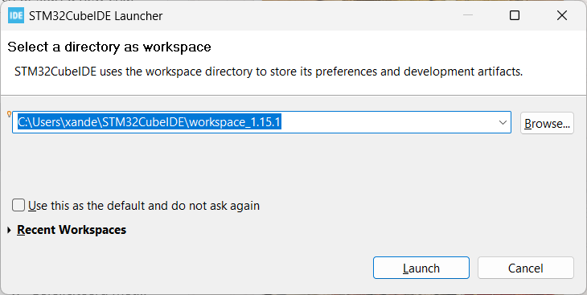
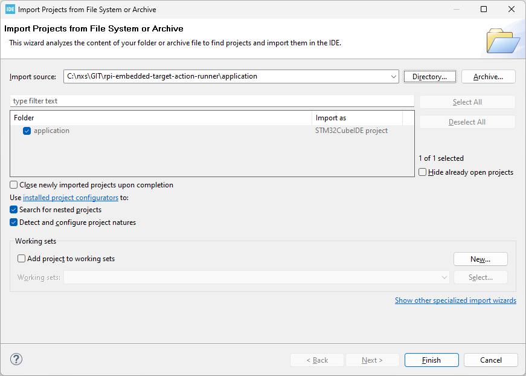

# Hardware used
## Raspberry Pi
The [Raspberry Pi 3 Model B](https://www.raspberrypi.com/products/raspberry-pi-3-model-b/) is a relatively cheap, but capabable compute module which is powerfull enough to deploy firmware from [Github actions](https://github.com/features/actions) on the target. It is out of the box supported by the [Github action runner](https://github.com/actions/runner).

## STM32 NUCLEO Board
The [STM32 NUCLEO](https://www.st.com/en/evaluation-tools/stm32-nucleo-boards.html) series of boards cover a wide range of 32 bit ARM core based MCU's. Devices are divided in the categories: mainstream, ultra low power and high performace. They offer many different perpherals, flash sizes and pin counts.
The [NUCLEO-F303K8](https://www.st.com/en/evaluation-tools/nucleo-f303k8.html) used here is near the lower end. It has a small footprint and its connectors are Arduino Nano compatible. Because the NUCLEAO boards all contain an embedded ST-LINK they support source level debugging with breakpoints and stepping through the code.

# Clone the

# Working with the STM32CubeIde project
Start the [STM32CubeIde](https://www.st.com/en/development-tools/stm32cubeide.html) and select a directory to use as workspace:

## Importing the project
And import the project from STM32 directory:

## Build the project
Press the build button and check the ouput in the cosole window at the bottom:

## Run the code in the debugger
To run the code on the target connect the USB cable, press the debug button and select **Debug Configurations...**

In the following dialog select the **sample_application Debug** and press the **Debug** button.

The IDE will take some time to process and when it's done it will stop at the first line of the main function. Before pressing the play button start a terminal program like [Tera Term](teraterm.md).

Once this has all been setup press the play button (green triangle) in the IDE. Check that the green LED on the NUCLEO board is blinking once a second and look at the output on the terminal. What is the version of the code?

## Release versioning
Projects will have different requirements for version numbering. The convention used in this workshop makes a clear distinction between official releases in the cloud on the master branch, releasing of the code on a branch and locally build images.

### Official release on master branch
When a build is done on the master branch the minor version number will be incremented for the build resulting in 0.1.0, 0.20, etc. The resulting binary will be renamed to show the version number sample_application-0.1.0.bin

### Branch build
A branch build has to be kicked off manually if it needs to be released. Otherwise it will only be build as part of the PR, but not released. The version will be set to 0.0.0 to indicate a branch build and the github commit is shown to indicate the 'version'. The name of the file will be sample_application-d44fd2fe0e-dev.bin

### Local builds
When a developer builds the code on his system the version is set 0.0.0 and the githash to **debugbuild**. As these builds could rely upon the individual configuration of the developer's sytem, these builds should never make it out into the field. The name of the binary is the default from the IDE: sample_application.bin

## IDE version information handling
In order to make sure that the firmware can report the correct version it needs to be given the version details as part of the build. In this project this is done with the [STM32/makefile.defs](STM32/makefile.defs). This file links environment variables ENV_VERSION_XXX to MAKE_VERSION_XXX, which in the IDE are presented with the defines VERSION_XXX through the Paths and Symbols dialog:

# Github action for building code
Create a file called .github/workflows/ci_pipeline.yml and add the following pipeline name:

    name: Continuous integration pipeline

Configure when to run the action. For now we'll start with all pushes to the master branch:

    on:
    push:
        branches:
        - master

# Setup the Github action runner on the RPi
## Preparing the SD Card
The SD Card for this project was created using the Windows version of the [Raspberry Pi Imager](https://www.raspberrypi.com/software/). On the first page of the tool select which RPi version to create an image for, Which image to use and which SD Card to write it to. Here we are using an RPi3 and the Raspberry OS Lite (Legacy, 64-bit):

Here is a clearer image of the image selection, as it is important to select the Bullseye legacy image. In the latest image the openocd tool can't be configured to the working, 0.11.0~rc2-1, version.

In the second dialog some inital setup of the RPi can be configured. It is good practice to use a unique hostname here, so it will be easy to access the device without having to use a monitor and keyboard. The dialog also allows the wirless network details to be given and a configuration of the timezone the device will be operating in.

The final dialog is left to default to enable the SSH out of the box for headless use:

# Prepare RPi action runner
login to the RPi using ssh:

`ssh pi@nxs-1`

After starting the RPi for the first time it is good practice to run the update and upgrade commands to make sure that the latest (security) updates are installed for the OS:
`sudo apt update ; sudo apt upgrade -y`

Install openocd which is used for programming the NUCLEO board:
`sudo apt install openocd=0.11.0~rc2-1`

NOTE that when `sudo apt upgrade` is run again that the openocd package will be upgraded to a later version which fails during flash write on the STM32 MCU. If this happens just run the above command again to downgrade the openocd to the 0.11.0~rc2-1 again.

