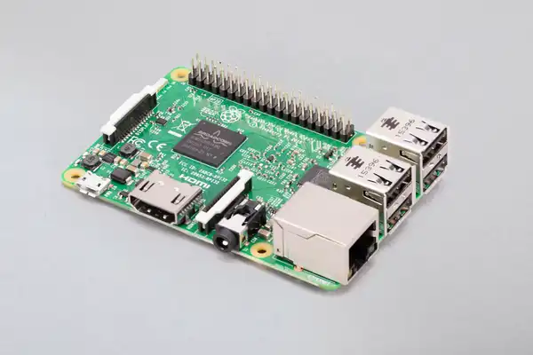
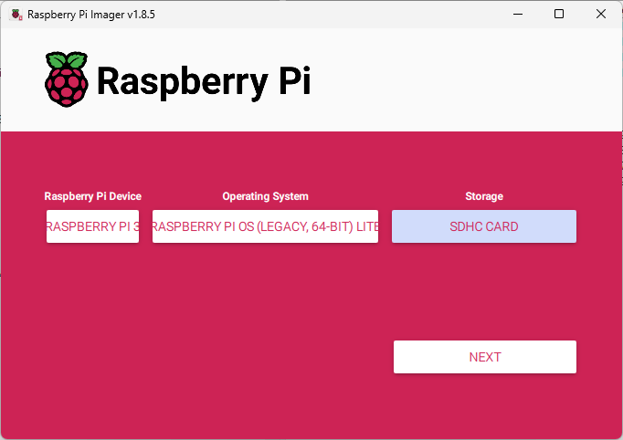
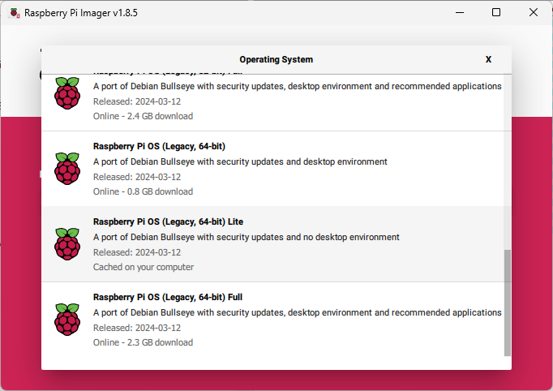

# Hardware used
## Raspberry Pi
The [Raspberry Pi 3 Model B](https://www.raspberrypi.com/products/raspberry-pi-3-model-b/) is a relatively cheap, but capabable compute module which is powerfull enough to deploy firmware from [Github actions](https://github.com/features/actions) on the target. It is out of the box supported by the [Github action runner](https://github.com/actions/runner).

## STM32 NUCLEO Board
The [STM32 NUCLEO](https://www.st.com/en/evaluation-tools/stm32-nucleo-boards.html) series of boards cover a wide range of 32 bit ARM core based MCU's. Devices are divided in the categories: mainstream, ultra low power and high performace. They offer many different perpherals, flash sizes and pin counts.
The [NUCLEO-F303K8](https://www.st.com/en/evaluation-tools/nucleo-f303k8.html) used here is near the lower end. It has a small footprint and its connectors are Arduino Nano compatible. Because the NUCLEAO boards all contain an embedded ST-LINK they support source level debugging with breakpoints and stepping through the code.

# Setup the Github action runner on the RPi
## Preparing the SD Card
The SD Card for this project was created using the Windows version of the [Raspberry Pi Imager](https://www.raspberrypi.com/software/). On the first page of the tool select which RPi version to create an image for, Which image to use and which SD Card to write it to. Here we are using an RPi3 and the Raspberry OS Lite (Legacy, 64-bit):

Here is a clearer image of the image selection, as it is important to select the Bullseye legacy image. In the latest image the openocd tool can't be configured to the working, 0.11.0~rc2-1, version.

In the second dialog some inital setup of the RPi can be configured. It is good practice to use a unique hostname here, so it will be easy to access the device without having to use a monitor and keyboard. The dialog also allows the wirless network details to be given and a configuration of the timezone the device will be operating in.

The final dialog is left to default to enable the SSH out of the box for headless use:

# Prepare RPi action runner
login to the RPi using ssh:

`ssh pi@nxs-1`

